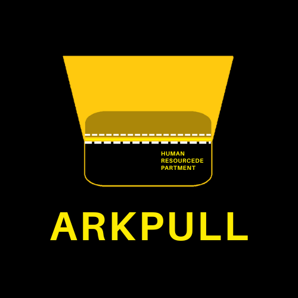
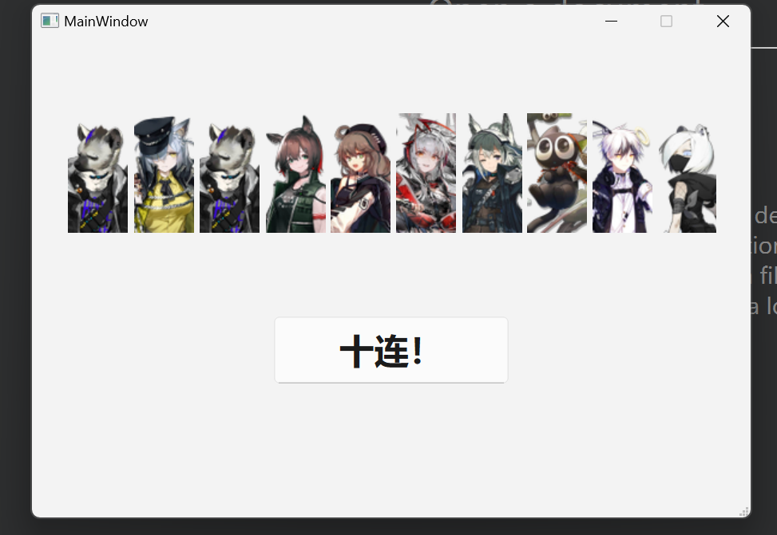
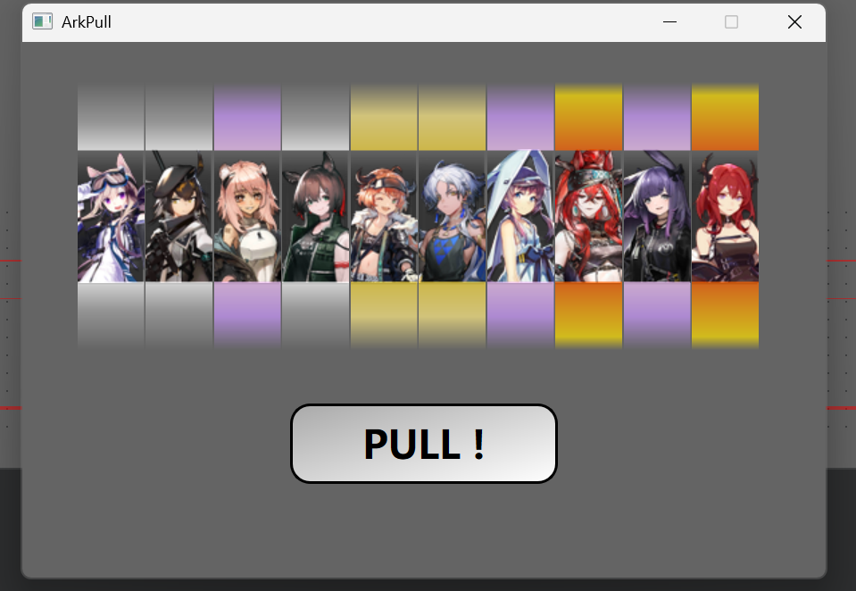

   <h1>ArkPull - 明日方舟抽卡模拟器 | ArkPull - Arknights Gacha Simulator</h1>
    
   

      ArkPull | 明日方舟抽卡模拟器 
      <code><b>v2.0</b></code>
   

   

      
      
      
      
   

   
      <i>This project mainly supports Chinese docs. If you are an English user, feel free to contact us.</i>
   

---

## 简介 | **Introduction**

**ArkPull** 是一款基于 **Qt** 实现的 **明日方舟** 抽卡模拟器。干员半身像素材来自 **[PrtsWiki](https://prts.wiki/w/PRTS:文件一览)**。该项目是我学习 **Qt** 的练手作品，后续将进一步优化 UI，提升用户体验。

**ArkPull** is an **Arknights** gacha simulator, implemented with **Qt**. The operator portraits are sourced from **[PrtsWiki](https://prts.wiki/w/PRTS:文件一览)**. This project is a personal learning project for **Qt**, and I plan to further optimize the UI to enhance user experience.

## 功能 | **Features**

- **模拟抽卡**：根据设定的概率从卡池中抽取干员。玩家可以模拟十连，并看到抽取到的干员半身图。
  
  **Gacha Simulation**: Draw operators from a gacha pool with preset probabilities. Players can simulate a ten-pull and view the operator portraits drawn.

- **历史记录**（未来计划）：查看并编辑自己的本地抽卡记录。
  
  **History Record** (Future Feature): View and edit local gacha records.

- **欧非评价**（未来计划）：根据抽卡记录给出欧非等级评估。
  
  **Evaluation of Luck** (Future Feature): Provide an evaluation of "luck" based on the gacha history.

- **UI 优化**（已实现）：干员图标根据稀有度发光（参考明日方舟游戏内效果）。
  
  **UI Optimization** (Implemented): Operator icons glow based on rarity (referencing effects from the Arknights game).

## 技术栈 | **Tech Stack**

- **Qt**：用于界面开发和用户交互处理。Qt 提供了强大的 UI 功能，可以方便地实现按钮、标签等控件。
  
  **Qt**: Used for UI development and user interaction. Qt offers powerful UI components, making it easy to implement buttons, labels, and other controls.

- **OpenGL**（未来计划）：用于渲染抽卡过程中的闪光和动画效果，使抽卡过程更具沉浸感。
  
  **OpenGL** (Future Feature): Used for rendering glows and animation effects during the gacha process, enhancing the immersive experience.

- **QML**（未来计划）：计划使用 QML 优化部分界面，以便更高效地实现动态和动画效果。
  
  **QML** (Future Feature): Plan to use QML to optimize parts of the interface for more efficient dynamic and animation effects.

## 计划 | **Future Plans**

- **UI 优化**：目前的界面较为简单，未来会增加更多的动效和细节，以更贴近 **明日方舟** 的风格。包括但不限于动态卡池展示、卡牌抽取过程的动画等。
  
  **UI Optimization**: The current interface is simple. Future updates will include more dynamic effects and details to better match the style of **Arknights**, including dynamic gacha pool displays and animation during the gacha process.

- **增加音效和语音**：为了增强抽卡体验，计划加入背景音乐和抽卡时的音效。
  
  **Add Sound Effects and Voice**: To enhance the gacha experience, background music and sound effects during the draw will be added.

- **多卡池支持**：计划增加更多的卡池类型和抽卡方式，可能加入一些定制的功能（例如抽卡策略调整）。
  
  **Multiple Gacha Pools**: More types of gacha pools and draw methods will be added, with the possibility of including customized features (e.g., adjusting draw strategies).

------

## 使用指南 | **Usage Guide**

### 1. 安装依赖 | **Install Dependencies**

- 依赖已打包在文件夹中。
  
  Dependencies are bundled in the folder.

### 2. 如何运行 | **How to Run**

- 克隆仓库，进入项目目录并点击 `ArkPull_ImgVer.exe` 启动程序（适用于 Windows 平台）。
  
  Clone the repository, navigate to the project directory, and run `ArkPull_ImgVer.exe` to launch the program (Windows platform).

### 3. 界面功能 | **Interface Features**

- 点击 `Pull` 按钮进行十次抽卡。
  
  Click the `Pull` button to perform a ten-pull.

- 每次抽卡后，您将看到抽到的干员半身图。
  
  After each pull, you will see the operator portrait you drew.

### 4. 卡池设置 | **Gacha Pool Settings**

- 目前**尚不支持**自定义不同卡池的概率和干员分布，您可以在代码中调整卡池设置。
  
  Customization of gacha pool probabilities and operator distribution is **not yet supported**. You can adjust the settings directly in the code.

------

## 截图展示 | **Screenshots**

**1.0版本：**  

**2.0版本：**  

------

## 联系我 | **Contact Me**

如果您有任何问题或建议，欢迎通过以下方式与我联系：

If you have any questions or suggestions, feel free to contact me via:

- **邮箱 | Email**: [qian85843@gmail.com](mailto:qian85843@gmail.com)
- **GitHub**: [QianZheZiAn](https://github.com/QianZheZiAn)

------

感谢您的使用！✨ >w<  
Thank you for using! ✨ >w<